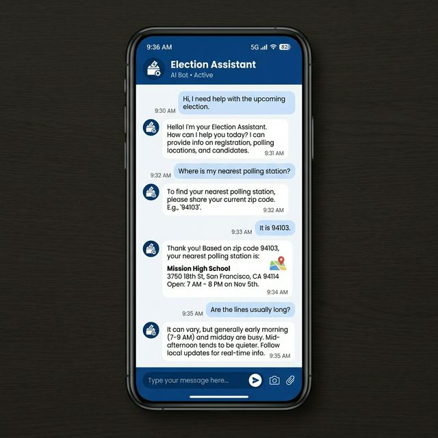

# Election Guide 🗳️

An interactive, responsive, and mobile-first Web Application acting as an unofficial Voter Information Portal. It serves to assist citizens on their voting journey, providing tools and structured information directly from their mobile browser.

## 🚀 Features

- **Interactive Voting Journey Stepper:** Track your election preparation progress from Eligibility Check to Voting Day.
- **Floating ECI Assistant (AskDISHA Style):** A built-in floating chatbot to provide instant answers to Frequently Asked Questions (registration, EVM details, required documents).
- **Election Timeline:** A beautifully crafted vertical timeline detailing campaign periods, voting dates, and result days.
- **Find Your Polling Booth:** A locator UI layout for searching your polling station using your PIN code.
- **Mobile-First PWA Design:** Thumb-friendly bottom navigation, full-width touch buttons, modern typography, and a polished, trustworthy government UI aesthetic.

## 🛠️ Technologies Used

- **HTML5** with Semantic tags and accessibility (Aria) attributes.
- **CSS3** utilizing Flexbox, CSS Variables for theming (Blue/Orange/Teal palette), and Media Queries for responsive layouts.
- **Vanilla JavaScript (ES6)** handling user interactions: Onboarding logic validation, Chatbot interface behavior, and dynamic DOM manipulation (No heavy frameworks like Next.js or React were needed to keep the footprint blazing fast and lightweight).

## 📸 Screenshots


*The main election dashboard featuring the voting journey tracker.*


*Interactive polling assistant delivering instant FAQs.*

## 💻 Running the App Locally

This is a purely static web application. To run it:

1. Clone the repository.
   ```bash
   git clone https://github.com/your-username/election_guide.git
   ```
2. Navigate into the project folder.
   ```bash
   cd election_guide
   ```
3. Open `index.html` in your favorite browser, or serve it locally using Python:
   ```bash
   # Python 3
   python3 -m http.server 8080
   ```
4. Access `http://localhost:8080` in your web browser.

## 🤝 Contribution
Contributions, issues, and feature requests are welcome! Feel free to check the issues page.
